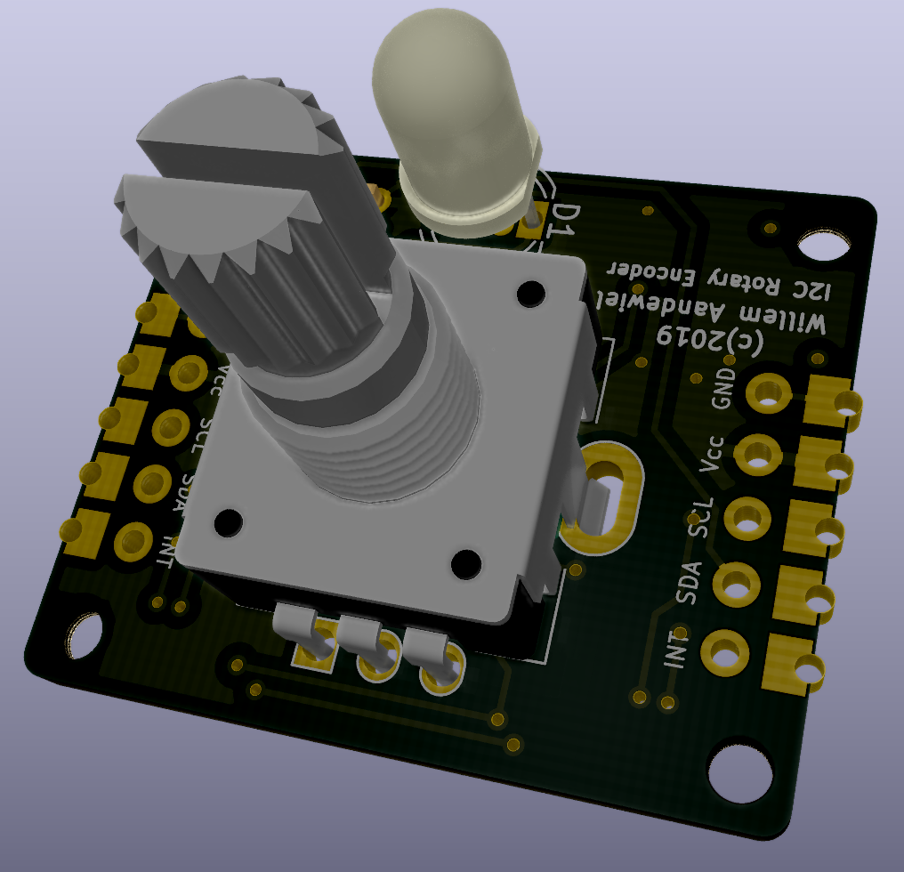
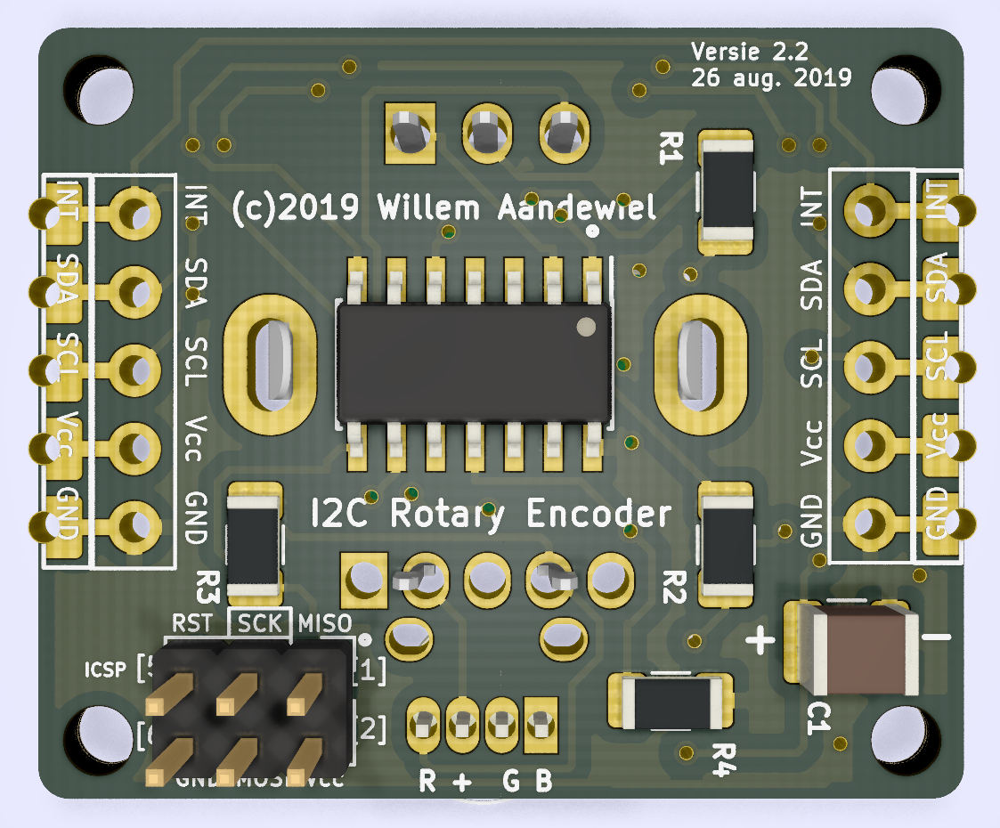

# Arduino library for the I2C_RotaryEncoder

<p>Find the project description at <a href="https://willem.aandewiel.nl/">www.aandewiel.nl</a>.</p>
<br>

This library gives an interface between your own program and the I2C_RotaryEncoder.

<center></center>

To use it you have to include this library in your sketch

```
#include <I2C_RotaryEncoder.h>
```

Declare an Encoder object (declare one for every I2C_RotaryEncoder):

```
I2CRE Encoder1; // Create instance of the I2CRE object
```

Create a interrupt service routine:

```
#ifdef ARDUINO_ARCH_ESP8266
  #define ISR_PREFIX        ICACHE_RAM_ATTR
//#define BUILTIN_LED       2
  #define _INTERRUPTPIN     12
#elif ARDUINO_ARCH_AVR
  #define ISR_PREFIX
  #define BUILTIN_LED       13
  #define _INTERRUPTPIN     3
#elif ARDUINO_ARCH_SAM
  #define ISR_PREFIX
  #define BUILTIN_LED       13
  #define _INTERRUPTPIN     3
#else
  #error "Don't know what type of board this is ..."
#endif

volatile bool interruptPending  = false;

ISR_PREFIX void handleInterrupt()
{
  interruptPending = true;
}
```

And in your <code>setup()</code> function attach the <code>_INTERRUPT_PIN</code> to this ISRoutine:

```
  pinMode(_INTERRUPTPIN, INPUT_PULLUP);
  attachInterrupt(digitalPinToInterrupt(_INTERRUPTPIN), handleInterrupt, FALLING);
```

In the main <code>loop()</code> function handle <code>interruptPending</code>.

```
void loop() 
{
  if (interruptPending) {
    interruptPending = false;
    if (Encoder1.isRotValChanged() ) {
    	Serial.print("Request Value of ROTARY [");
    	rotVal = Encoder1.getRotVal();
    	Serial.print(rotVal);
    	Serial.println("]");
    }

    if (Encoder1.isButtonPressed() ) {
    	Serial.println("-------> Button Pressed ");
    }
    if (Encoder1.isButtonQuickReleased() ) {
    	Serial.println("-------> Quick Release");
    }
    if (Encoder1.isButtonMidReleased() ) {
    	Serial.println("-------> Mid Release);
    }
    if (Encoder1.isButtonLongReleased() ) {
    	Serial.println("-------> Long Release);
    }
  }
}	// loop()
```

<center></center>

The library gives you the following setters:
| setter | returns | parms | function |
|--------|---------|-------|----------|
| setRotVal() | bool | int16_t | set the value of the Rotary Encoder (-1024 .. + 1024)|
| setRotStep() | bool | int16_t | set the rotary Step (1 .. 50) |
| setRotMin() | bool | int16_t | set the Minimum rotary value (-1024 .. +1024)|
| setRotMax() | bool | int16_t | set the Maximum rotary value (-1024 .. +1024)|
| setRotSpinTime() | bool | uint8_t | set the Rotary Spin thime value (2 .. 100 milli seconds)|
| setRGBcolor() | bool | uint8_t, uint8_t, uint8_t|set the color of all 3 leds  Red, Green, Blue<br>(0 .. 255, 0 .. 255, 0 .. 255)|
| setRGBcolor() | bool | uint32_t |set the RGB color of all 3 leds (0x000000 .. 0xFFFFFF)|
| setLedRed() | bool | uint8_t| set the PWM value of the Red led (0 .. 255)|
| setLedGreen() | bool | uint8_t| set the PWM value of the Green led (0 .. 255)|
| setLedBlue() | bool | uint8_t|set the PWM value of the Blue led (0 .. 255)|
| setDebounceTime() | bool | uint8_t| set the Debounce Time of the switch (5 .. 250 micro seconds)|
| setMidPressTime() | bool | uint16_t|set the Mid Press Time of the switch (100 .. 5000 milli seconds)|
| setLongPressTime() | bool | uint16_t| set the Long Press Time of the switch (300 .. 10000 milli seconds)|
| setModeSetBit() | bool | uint8_t|set the Mode Bit (STNG_HWROTDIR | STNG_FLIPMODE | STNG_TURNMODE)|
| setModeClearBit() | bool | uint8_t| clears the Mode Bit (STNG_HWROTDIR | STNG_FLIPMODE | STNG_TURNMODE)|
| set  writeCommand() | bool | uint8_t| write a command to the Slave (CMD_READCONF | CMD_WRITECONF | CMD_REBOOT)|
| setI2Caddress() | bool | uint8_t | set a new I2C address for this Slave (1 .. 127)|


<center></center>
